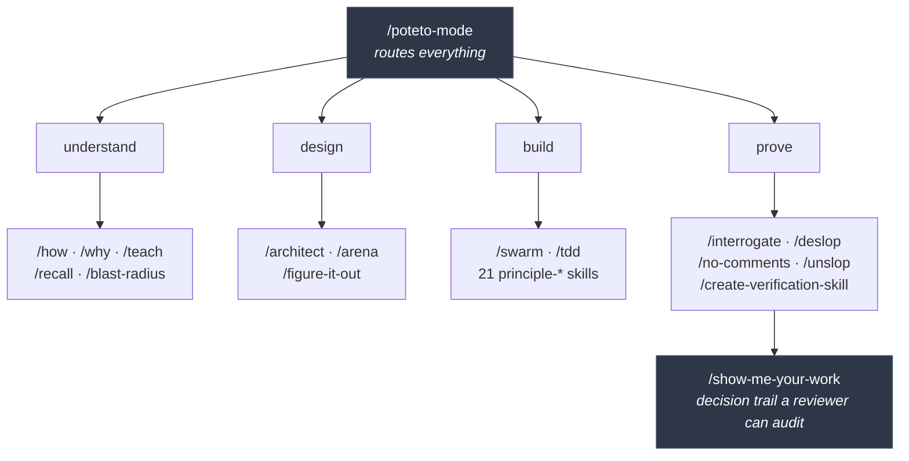

<div align="center">

# cstack

**If you want to go fast, go deep first.**

46 skills and 2 agents for Claude Code. Orchestration, adversarial review, real verification, and 21 engineering principles.

A Claude Code port of [pstack](https://github.com/cursor/plugins/tree/main/pstack) by [Lauren Tan](https://github.com/poteto).

</div>

---

## Install

```bash
/plugin marketplace add irg1008/cstack
/plugin install cstack@cstack
/setup-cstack
```

`/setup-cstack` runs once. It checks for [bun](https://bun.sh) and writes your per-role model choices.

Everything is opt in. Adding the marketplace installs nothing. The Slack automations live in a second plugin you never have to touch.

---

## What do you want to do?

| You're about to... | Run | What you get |
| --- | --- | --- |
| Change code you don't understand | `/how` | A walkthrough from parallel explorers, then a critic panel that attacks the explanation |
| Find out why the code is like this | `/why` | Your MCPs queried in parallel (git, tickets, docs, chat, Sentry, analytics), then a cited answer |
| Start non-trivial work | `/architect` | Types, signatures and module shape settled before any code gets written |
| Pick between approaches | `/arena` | N candidates built in parallel, one picked as base, the best parts of the losers grafted in |
| Ship a risky diff | `/blast-radius` | What breaks outside the diff, proven by running code instead of reasoning about it |
| Get torn apart before review | `/interrogate` | Four reviewers attacking from independent angles |
| Clean agent-written code | `/deslop`, then `/no-comments` | Slop stripped, then Comment Sicko deletes the narration |
| Clean agent-written prose | `/unslop` | 31 AI tells removed from docs, PRs and commits |
| Prove it actually works | `/create-verification-skill` | A project-local skill that drives your real app the way a user does |
| Come back after a week away | `/recall` | Your own history reconstructed into a current-state brief |
| Understand what you just built | `/teach` | `how` and `why` run together, woven into one plain explanation |
| Hand work to an agent overnight | `/poteto-mode` | The full style, 22 playbooks, decision logs, verification gates |

---

## How the pieces fit



You do not have to adopt the whole thing. Most skills work standalone. `/how` and `/unslop` are useful on day one with nothing else installed.

---

## The skills

<details open>
<summary><b>Investigation.</b> Understand before you touch it</summary>

<br/>

- **`/how`** Runtime flow and architecture. Spawns parallel explorers, an explainer, then a critic panel that challenges the explanation. Also answers placement questions: where should this live, which package owns it, is this the right layer.
- **`/why`** Design rationale. Discovers which MCPs you have, then queries every evidence category in parallel: source control, issue tracker, long-form docs, chat, observability, error tracking, analytics. Returns a cited read on decisions and tradeoffs. Use it before a regression postmortem, or when someone asks why a threshold is 500ms.
- **`/teach`** Runs `how` and `why`, weaves both into one explanation a person can actually follow.
- **`/recall`** Reconstructs your recent working context from chat history, live state and the shared record. For "where did I leave off".
- **`/blast-radius`** What a change could break elsewhere. Proves the one fact it is safe because of by running real code, not by writing up an analysis.
- **`/bro`** Restates the last message in plain human language, no jargon.

</details>

<details open>
<summary><b>Design and orchestration.</b> Get the shape right first</summary>

<br/>

- **`/architect`** Sketches types, signatures and module structure before code, then stays in the loop while implementation fills in. Use it when jumping straight to code would lock in the wrong shape.
- **`/arena`** Spawns N parallel candidates at the same task, picks a base, grafts the strongest parts of the losers into it. For novel UI interactions and architectural calls with no precedent in the codebase.
- **`/swarm`** Fans out N workers, drains them, returns one report. Parallel coverage, races, gauntlets, exploration.
- **`/figure-it-out`** The fallback playbook when no narrower one fits: large migrations, ambitious multi-part changes, work a human reviews after stepping away. Scales rigor to the task and logs decisions.
- **`/poteto-mode`** The umbrella style. 22 playbooks covering features, bug fixes, refactors, perf work, PR opening, babysitting CI, shipping, worktree cleanup, runtime forensics, and full autopilot.
- **`/show-me-your-work`** A TSV log, one row per decision: what, why, evidence, result. Local by default. Commit it when a reviewer needs the trail to trust the result.

</details>

<details open>
<summary><b>Review and cleanup.</b> Before anyone else sees it</summary>

<br/>

- **`/interrogate`** Multiple reviewers challenge your changes from independent angles. For "find blind spots" and "tear this apart".
- **`/deslop`** Strips AI code slop from the branch diff: over-commenting, defensive try/catch on trusted paths, `as any` casts, deep nesting that early returns would flatten. Keeps behavior unchanged.
- **`/no-comments`** Spawns Comment Sicko, a deranged comment-hater that savors deletion. Fixes accepted findings and offers encodings for claimed constraints.
- **`/unslop`** 31 patterns of AI tells in writing: em dashes, "delve", rule of three, passive voice, inline-header lists, generic conclusions. Works on docs, PR bodies and commit messages.
- **`/reflect`** Three parallel reviewers over the active transcript. Surfaces learnings and routes each to a concrete edit on an existing skill.
- **`/tdd`** Only when you actually asked for it, or the bug has an obvious cheap local test target.

</details>

<details open>
<summary><b>Verification.</b> "It compiles" is not proof</summary>

<br/>

- **`/create-verification-skill`** Generates a project-local skill that drives your app the way a user does. Any language, framework or platform. Use it when a project has no scripted way to prove UI, CLI or service behavior.
- **`/maintain-verification-skill`** Periodic pass that keeps that skill and its feature map honest. Parallel source readers per feature, one live session driving every feature, at most one PR of proven corrections.

</details>

<details>
<summary><b>Writing</b></summary>

<br/>

- **`/technical-writing`** Diátaxis structure, Google developer style, STE instruction rules, Global English syntax. For docs, RFCs, readmes, PR descriptions and commit messages.
- **`/typescript-best-practices`** Applies when reading or editing any `.ts` or `.tsx`.
- **`/automate-me`** Drafts a personal `-mode` skill from how you actually work, optionally pulling evidence from recent transcripts.

</details>

<details>
<summary><b>The 21 principles.</b> One idea each, routed by poteto-mode</summary>

<br/>

Each is a small skill holding one idea. They are marked `disable-model-invocation`, so Claude does not reach for them on its own: `/poteto-mode` routes to the right one from its Principles index while working, and you can invoke any of them directly. Running the whole stack without `/poteto-mode` leaves them dormant.

| Principle | Applies when |
| --- | --- |
| `fix-root-causes` | Debugging. Trace each symptom to its root; resist nil-checks that silence crashes |
| `prove-it-works` | Before declaring done. Verify against the real artifact, not a proxy |
| `type-system-discipline` | Designing types. Make illegal states unrepresentable, parse at boundaries |
| `laziness-protocol` | Tempted to add abstraction. Bias toward deletion |
| `guard-the-context-window` | Context filling up. Route bulk to subagents, keep summaries in the main thread |
| `build-the-lever` | Any non-trivial work. Build the tool that does it, so a reviewer can rerun it |
| `never-block-on-the-human` | Tempted to ask "should I?" on reversible work. Proceed, let them course-correct |
| `minimize-reader-load` | Code is hard to trace. Collapse one-caller wrappers, shrink mutable scope |
| `model-the-domain` | Branching a lot. Encode the domain in a structure, not scattered conditionals |
| `foundational-thinking` | Before writing logic. Get the data structures right first |

Plus `boundary-discipline`, `encode-lessons-in-structure`, `exhaust-the-design-space`, `experience-first`, `make-operations-idempotent`, `migrate-callers-then-delete-legacy-apis`, `outcome-oriented-execution`, `redesign-from-first-principles`, `separate-before-serializing-shared-state`, `sequence-verifiable-units`, `subtract-before-you-add`.

</details>

---

## The Slack automations, a separate plugin you can skip

`cstack-benny` is a Slack issue bot. It is **not** installed by the command above. Install it only if you want it:

```bash
/plugin install cstack-benny@cstack
```

Two automations. One triages every new report in a channel: classifies it, traces the owning layer, searches your tracker for duplicates, replies once in the thread with a tagged verdict. The other waits for that verdict, reproduces the bug twice through the real UI with screenshots and video, then may attempt one bounded root-cause fix and open a **draft** PR when before-and-after proof passes.

It never posts a root message, never merges, never deploys, and fails closed when the tracker, control adapter or feature map are missing. Setup is real work: a Slack app, a tracker integration, a feature map, and a trigger you wire yourself. See [`RUNNERS.md`](./plugins/cstack-benny/RUNNERS.md).

---

## What this costs you

Claude Code loads every installed skill's name and description into context, and the body only when a skill runs.

`cstack` adds roughly **2,700 tokens** per session. About 1,000 of that is the 21 principles.

Only 6 skills are auto-invocable: `deslop`, `how`, `why`, `unslop`, `typescript-best-practices` and `setup-cstack`. The other 39 carry `disable-model-invocation: true`, so they run when you type them or when `/poteto-mode` routes to them. That is deliberate: 45 skills all competing to auto-fire would be worse than none. It does mean you have to know the slash commands exist, which is what the routing table above is for.

---

## What changed from pstack

Paths and manifests, mostly. Four things are worth knowing.

**Model panels are less independent.** pstack's `how` critics, `arena` runners, `architect` runners and `interrogate` reviewers each spawn four subagents across four vendors. Claude Code's `Agent` tool takes `opus`, `fable`, `sonnet`, `haiku` and nothing else, so panels now run four Claude models. Most of the value was always in the reviewer prompts, which attack from independent angles regardless. A cstack panel can still agree with itself more readily than a pstack one would.

**Tool parameters were remapped.** `Task` is `Agent`. `generalPurpose` is `general-purpose`. `readonly: true` is `subagent_type: Explore`. `environment: "cloud"` is `isolation: "remote"`.

Those renames were applied to prose only. `skills/poteto-mode/scripts/` is upstream's code byte for byte, apart from one transcript path, so its identifiers stay intact. Typecheck and `bun test orch watch-pr` pass; two orch tests fail on Windows because upstream's fake `gt` helper writes an extensionless shell script and joins `PATH` with `:`.

**`deslop` is vendored in.** pstack calls a `deslop` skill from the separate `cursor-team-kit` Cursor plugin. It is included here, merged with the upstream version, so cstack stands alone.

**`control-ui` and `control-cli` have no equivalent.** Also `cursor-team-kit`. References now point at `create-verification-skill`, which generates a project-local `verify-*` skill that does the same job.

---

## Credits

All skill content is [Lauren Tan's](https://github.com/poteto), MIT licensed. `deslop` is from [cursor-team-kit](https://github.com/cursor/plugins/tree/main/cursor-team-kit) by Eric Zakariasson, also MIT. This repo is the port, not the ideas.
